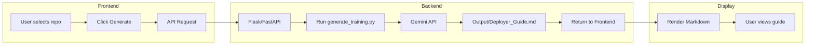

# Deployer Training Materials Generator

Generate comprehensive deployer and developer training documentation by scanning a codebase using Gemini AI.

## Overview

This plugin addresses **EU AI Act Articles 13 & 14** (Transparency & Human Oversight) by automatically generating structured training materials for:

- **Deployers**: Operations teams setting up and running the system
- **Developers**: Engineers extending or maintaining the codebase

## How It Works

1. **Scans** your entire codebase (all programming languages)
2. **Ingests** file contents while respecting `.gitignore` and excluding `.env`
3. **Generates** a structured guide using Gemini AI (section-by-section to avoid truncation)
4. **Outputs** a comprehensive Markdown document

## Output Structure

The generated `Deployer_Guide.md` contains:

| Section | Contents |
|---------|----------|
| **1. Executive Summary** | High-level product overview |
| **2. System Architecture** | Component diagrams (Mermaid), data flow, tech stack |
| **3. Product Capabilities** | Core features, user journeys, configuration options |
| **4. Developer Onboarding** | Environment setup, extension patterns, testing |
| **5. Operational Guide** | Deployment strategy, troubleshooting & limitations |

## Usage

```bash
python scripts/generate_training.py --path /path/to/repo --name "Your Product"
```

Output is saved to project root `Output/Deployer_Guide.md`.

## Model Fallback

| Priority | Model | Purpose |
|----------|-------|---------|
| Primary | `gemini-3-pro-preview` | High fidelity output |
| Fallback | `gemini-2.0-flash-exp` | High availability |

---

## Frontend & Backend Integration

This plugin is designed to integrate with larger AI compliance systems:

### Backend Integration

```
┌─────────────────────────────────────────────────────────────┐
│                     Backend Service                          │
├─────────────────────────────────────────────────────────────┤
│  1. Receive codebase path from frontend                     │
│  2. Call: python generate_training.py --path <path>         │
│  3. Read generated Output/Deployer_Guide.md                 │
│  4. Return content to frontend via API                      │
└─────────────────────────────────────────────────────────────┘
```

**Example Backend Endpoint (Python/Flask):**

```python
@app.route('/api/generate-training', methods=['POST'])
def generate_training():
    repo_path = request.json.get('path')
    product_name = request.json.get('name', 'Product')
    
    # Run the generator
    result = subprocess.run([
        'python', 'scripts/generate_training.py',
        '--path', repo_path,
        '--name', product_name
    ], capture_output=True)
    
    # Read and return the generated guide
    with open('Output/Deployer_Guide.md', 'r') as f:
        guide_content = f.read()
    
    return jsonify({'guide': guide_content})
```

### Frontend Integration

```
┌─────────────────────────────────────────────────────────────┐
│                     Frontend UI                              │
├─────────────────────────────────────────────────────────────┤
│  1. User selects a repository/project                       │
│  2. User clicks "Generate Training Materials"               │
│  3. Frontend calls backend API                              │
│  4. Display generated Markdown (with Mermaid rendering)     │
│  5. Option to download as PDF or view inline                │
└─────────────────────────────────────────────────────────────┘
```

**Example Frontend Flow (React):**

```jsx
const generateTraining = async () => {
  setLoading(true);
  const response = await fetch('/api/generate-training', {
    method: 'POST',
    headers: { 'Content-Type': 'application/json' },
    body: JSON.stringify({ path: selectedRepo, name: productName })
  });
  const data = await response.json();
  setGuideContent(data.guide);
  setLoading(false);
};
```

### Full System Architecture



## EU AI Act Compliance

| Article | Requirement | How This Plugin Helps |
|---------|-------------|----------------------|
| **Article 13** | Transparency | Auto-generates clear system documentation |
| **Article 14** | Human Oversight | Provides deployer training materials |

## Files

| Path | Description |
|------|-------------|
| `scripts/generate_training.py` | Main generator script |
| `SKILL.md` | Agent skill definition |
| `examples/fake_ai_product/` | Sample project for testing |
| `Output/` | Generated documentation (project root) |
