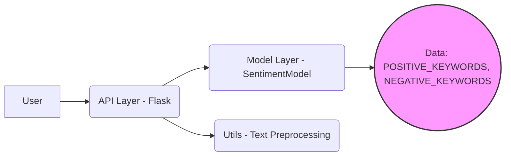

# Fake AI Product - Deployer & Developer Guide

## 1. Executive Summary

FakeAI is a sentiment analysis API designed for quick and easy integration into applications requiring text sentiment classification. It provides a simple REST endpoint that accepts text as input and returns a JSON response containing the predicted sentiment (positive, negative, or neutral) along with a confidence score. The API is built using Flask and utilizes a basic Naive Bayes-inspired model based on keyword matching for sentiment determination.

This product is ideal for developers who need a lightweight sentiment analysis solution without the overhead of complex machine learning models. It's particularly useful for prototyping, educational purposes, or scenarios where high accuracy is not a primary requirement. The API is designed to be easily deployable and configurable, making it accessible for both experienced and novice developers. The simplicity of the model allows for easy understanding and modification, enabling developers to customize the sentiment analysis based on specific domain knowledge or requirements.

## 2. System Architecture

### 2.1 Component Diagram



### 2.2 Data Flow

1.  **User Request:** A user sends a POST request to the `/analyze` endpoint of the API with a JSON payload containing the text to be analyzed.
2.  **API Layer:** The Flask API receives the request and extracts the text from the JSON payload.
3.  **Text Preprocessing:** The text is passed to the `preprocess_text` function in `src/utils.py` for cleaning (lowercasing, punctuation removal, whitespace stripping).
4.  **Model Prediction:** The preprocessed text is then passed to the `predict` method of the `SentimentModel` class in `src/model.py`.
5.  **Sentiment Analysis:** The `SentimentModel` analyzes the text based on the presence of predefined positive and negative keywords.
6.  **Response Generation:** The model returns a sentiment label (positive, negative, or neutral) and a confidence score. The API then constructs a JSON response containing this information.
7.  **User Response:** The API sends the JSON response back to the user.

### 2.3 Tech Stack

*   **Python:** The primary programming language.
*   **Flask:** A micro web framework for creating the REST API (`src/api.py`).
*   **re (Regular Expression):** Python's built-in library for text processing in `src/utils.py`.

## 3. Product Capabilities

### 3.1 Core Features

*   **Sentiment Analysis:**
    *   **What it does:** Analyzes the sentiment of a given text input and classifies it as positive, negative, or neutral.
    *   **How it works:** The `SentimentModel` in `src/model.py` uses a keyword-based approach. It checks for the presence of predefined positive and negative keywords in the input text. Based on the counts of these keywords, it determines the sentiment and assigns a confidence score.
    *   **Key configuration options:** The `POSITIVE_KEYWORDS` and `NEGATIVE_KEYWORDS` lists within the `SentimentModel` class can be modified to customize the sentiment analysis based on specific domain knowledge.

*   **Health Check:**
    *   **What it does:** Provides a simple endpoint to check the API's availability and health.
    *   **How it works:** The `/health` endpoint in `src/api.py` returns a JSON response with the status "healthy". This endpoint can be used by monitoring systems to ensure the API is running correctly.
    *   **Key configuration options:** None.

### 3.2 User Journeys

*   **Journey for "The Deployer":**
    1.  **Install Dependencies:** Clone the repository and install the required Python packages using `pip install -r requirements.txt`.  (Note: `requirements.txt` is not present in the codebase, but this step is essential).
    2.  **Configure Environment:** Set the `PORT` environment variable to the desired port number (default is 5000). Optionally, set the `MODEL_PATH` if you were using a serialized model (Not applicable in the current codebase).
    3.  **Run the API:** Execute the `src/api.py` script using `python src/api.py`. This will start the Flask development server.
    4.  **Verify Deployment:** Access the `/health` endpoint (e.g., `http://localhost:5000/health`) to confirm the API is running and returns a "healthy" status.

*   **Journey for "The End User":**
    1.  **Send Request:** Send a POST request to the `/analyze` endpoint (e.g., `http://localhost:5000/analyze`) with a JSON payload containing the text to be analyzed. For example:

        ```json
        {
          "text": "This is a great product!"
        }
        ```

    2.  **Receive Response:** The API will return a JSON response containing the sentiment and confidence score. For example:

        ```json
        {
          "sentiment": "positive",
          "confidence": 0.96
        }
        ```

### 3.3 Configuration Options

| Variable     | Default | Description